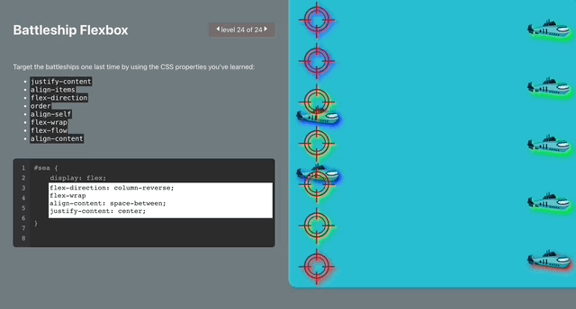

# Battleship Flexbox v0.2

Game designed to learn flexbox. Heavily inspired on [Flexbox Froggy](https://flexboxfroggy.com/). Basically Flexbox
Froggy ripoff.

**I don't want any credit**, I created this project solely for learning purposes.

Project is not finished, some levels are not implemented, there are plenty of QoL improvements in the plan.
# Used Technologies

React, JS

# Gifs

Solving first level. As you can see the board reacts in the real time.

More complicated one, even 4 different css lines.

# How to run

Clone the repository and run `npm start` command.

# todo
- [x] ~~working demo~~
- [ ] FIX bug "when deleting your answer, some dynamic css is still there until value of css is cleared"
- [ ] FIX levels when you need to modify css of `.targets` instead of `.sea` 
- [x] FIX levels when it requires modified starting css of `.sea`
- [ ] Fully translate froggy texts to battleship-themed
- [ ] add some QoL upgrades
  - [ ] level chooser, not only previous/next
  - [ ] "next" button after solving level correctly
- [ ] footer with links to github etc.
- [ ] different languages
- [ ] credits to Flexbox Froggy in code 
- [x] Now the answer textarea is cleared between levels. 
  - [ ] Add retaining previously filled answers, even between sessions. 
- [ ] refactor "levels.js" to *.jsx 